# Awesome Go Books

 

GoBooks is a carefully curated collection of the best Go books available for developers of all levels, from beginners learning the basics of Golang to experienced engineers looking for advanced concurrency, performance, and system design topics. This repository gathers top Golang books covering core Go concepts, real-world patterns, best practices, and modern Go development, making it easy to find the right learning resource in one place. Whether you’re searching for your first Golang book, want to deepen your understanding of Go internals, or are looking for the most recommended and up-to-date Go programming books, GoBooks serves as a trusted reference for the Go community.

- [Awesome Go Books](#awesome-go-books)
  - [Starter Books](#starter-books)
    - [The Go Programming Language](#the-go-programming-language)
    - [Learning Go *Free*](#learning-go)
    - [Get Programming with Go](#get-programming-with-go)
    - [API Foundations in Go](#api-foundations-in-go)
    - [Go for Javascript Developers *Free*](#go-for-javascript-developers)
    - [The Go Workshop](#the-go-workshop)
    - [Head First Go](#head-first-go)
    - [How to Code in Go](#how-to-code-in-go)
    - [Go, from the beginning *Free*](#go-from-the-beginning-free)
    - [Practical Go Lessons *Free*](#practical-go-lessons-free)
    - [Pro Go](#pro-go)
    - [Go for DevOps](#go-for-devops)
    - [gRPC Microservices in Go](#grpc-microservices-in-go)
    - [Learn Go With Tests *Free*](#learn-go-with-tests-free)
    - [Go 101 *Free*](#go-101)
    - [Persian - Go Programming Language *Free*](#go-programming-language)
    - [gRPC Go for Professionals](#grpc-go-for-professionals)
    - [Learn Go with Pocket-Sized Projects](#learn-go-with-pocket-sized-projects)
    - [Go Faster](#go-faster)
    - [Shipping Go](#shipping-go)
    - [Learning Go: An Idiomatic Approach to Real-World Go Programming, 2nd Edition](#learning-go-an-idiomatic-approach-to-real-world-go-programming-2nd-edition)
    - [Go Programming - From Beginner to Professional, 2nd Edition](#go-programming---from-beginner-to-professional-2nd-edition)   
    - [The Deeper Love of Go](#the-deeper-love-of-go)

  - [Advanced Books](#advanced-books)
    - [Hands-On Dependency Injection in Go](#hands-on-dependency-injection-in-go)
    - [Security with Go](#security-with-go)
    - [A Go Developer's Notebook](#a-go-developers-notebook)
    - [Learn Data Structures and Algorithms with Golang](#learn-data-structures-and-algorithms-with-golang)
    - [Black Hat Go](#black-hat-go)
    - [Writing An Interpreter In Go](#writing-an-interpreter-in-go)
    - [Writing A Compiler In Go](#writing-a-compiler-in-go)
    - [Hands-On Software Engineering with Golang](#hands-on-software-engineering-with-golang)
    - [Building Distributed Applications in Gin](#building-distributed-applications-in-gin)
    - [Network Programming with Go](#network-programming-with-go)
    - [Powerful Command-Line Applications in Go](#powerful-command-line-applications-in-go)
    - [Cloud Native Go - Building Reliable Services in Unreliable Environments](#cloud-native-go---building-reliable-services-in-unreliable-environments)
    - [Everyday Go](#everyday-go)
    - [Practical Go: Building Scalable Network and Non-Network Applications](#practical-go-building-scalable-network-and-non-network-applications)
    - [Microservices with Go](#microservices-with-go)
    - [Event-Driven Architecture in Golang](#event-driven-architecture-in-golang)
    - [Efficient Go: Data-Driven Performance Optimization](#efficient-go-data-driven-performance-optimization)
    - [100 Go Mistakes and How to Avoid Them](#100-go-mistakes-and-how-to-avoid-them)
    - [Know Go: Generics](#know-go-generics)
    - [The Power of Go: Tests](#the-power-of-go-tests)
    - [Beyond Effective Go: Part 1 - Achieving High-Performance Code](#beyond-effective-go-part-1---achieving-high-performance-code)
    - [Domain-Driven Design with Golang](#domain-driven-design-with-golang)
    - [Go programming language secure coding practices guide *Free*](#go-programming-language-secure-coding-practices-guide-free)
    - [Network Automation with Go](#network-automation-with-go)
    - [The Power of Go: Tools](#the-power-of-go-tools)
    - [Build an Orchestrator in Go](#build-an-orchestrator-in-go)
    - [Explore Go: Cryptography](#explore-go-cryptography)
    - [Practical guide for building a blockchain from scratch in Go with gRPC](#practical-guide-for-building-a-blockchain-from-scratch-in-go-with-grpc-free)
    - [Go at Scale: Patterns for Professional Development](#go-at-scale-patterns-for-professional-development)
    - [Go with the Domain: Building Modern Business Software in Go *Free*](#go-with-the-domain-building-modern-business-software-in-go-free)
    - [Spaceship Go *Free*](#spaceship-go-free)
    - [Ultimate Go Notebook](#ultimate-go-notebook)

  - [Web Development](#web-development)
    - [12 Factor Applications with Docker and Go](#12-factor-applications-with-docker-and-go)
    - [Webapps in Go the anti textbook *Free*](#webapps-in-go-the-anti-textbook-free)
    - [Build SaaS apps in Go](#build-saas-apps-in-go)
    - [Go Brain Teasers](#go-brain-teasers)
    - [Creative DIY Microcontroller Projects with TinyGo and WebAssembly](#creative-diy-microcontroller-projects-with-tinygo-and-webassembly)
    - [Distributed Services with Go Your Guide to Reliable, Scalable, and Maintainable Systems](#distributed-services-with-go-your-guide-to-reliable-scalable-and-maintainable-systems)
    - [Build Systems with Go: Everything a Gopher Must Know](#build-systems-with-go-everything-a-gopher-must-know)
    - [Let's Go!](#lets-go)
    - [Let's Go Further](#lets-go-further)
    - [Mastering Go, 4rd edition](#mastering-go-4rd-edition)
    - [Web Development with Go: Learn to Create Real World Web Applications using Go](#web-development-with-go-learn-to-create-real-world-web-applications-using-go)
    - [Wasm Cooking with Golang](#wasm-cooking-with-golang)
    - [Generative Art in Go](#generative-art-in-go)
    - [Building Web Apps with Go *Free*](#building-web-apps-with-go-free)
    - [Build Web Application with Golang *Free*](#build-web-application-with-golang-free)
  - [Resources](#resources)
    - [A tour of Go](#a-tour-of-go)
    - [Video: Learn Go Syntax in one video](#video-learn-go-syntax-in-one-video)
    - [Tutorials: Go by Example](#tutorials-go-by-example)
    - [Go Fundamentals Video Training](#go-fundamentals-video-training)
    - [More Books on the Go Wiki](#more-books-on-the-go-wiki)
    - [TutorialEdge.net Course](#tutorialedgenet-course)
    - [Coursera Specialization: Programming with Go](#coursera-specialization-programming-with-go)
    - [Course: Understand Go's In-Depth Mechanics](#course-understand-gos-in-depth-mechanics)
    - [Course: Mastering Go Programming](#course-mastering-go-programming)
    - [Course: Web Development with Google’s Go Programming Language](#course-web-development-with-googles-go-programming-language)
    - [Golangbot.com Articles](#golangbotcom-articles)
    - [Tuxerrante repo on go exercises](#tuxerrante-repo-on-go-exercises)
- [Contributing](#contributing)
- [License](#license)

## Starter Books

> Here are the top recommended books for absolute beginners—those with little or no programming experience—who want to learn Go from the very start

### [The Go Programming Language](https://amzn.to/3MbHW7i) 

<a href="https://amzn.to/3MbHW7i">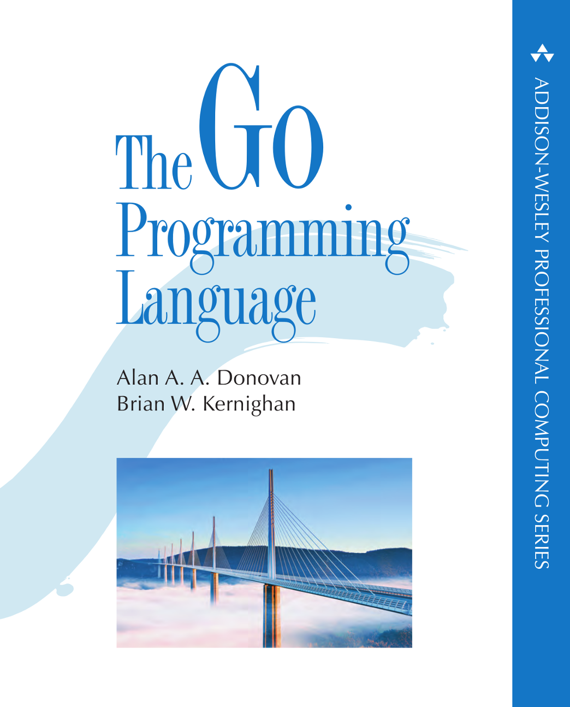</a>

*Last published*: **2015**
*Authors:* **Alan A. A. Donovan** and **Brian W. Kernighan**
*Available as*: **eBook**, **Print**

Widely regarded as the definitive guide to Go programming, this book offers an in-depth exploration of the language's syntax, data structures, and unique features such as goroutines and channels. Key topics include concurrency, error handling, and best practices in software engineering. Whether you're a developer transitioning from another language or someone seeking to deepen your Go knowledge, this book is an invaluable resource for mastering both foundational and advanced concepts.

-----

### [Learning Go](https://www.miek.nl/go)

*Last published*: **2018**
*Authors:* **Miek Gieben**
*Avaible For Free* : **[Source Code](https://github.com/miekg/learninggo)**

A online book to start learning Golang. It features numerous exercises (and answers).

-----

### [Get Programming with Go](https://amzn.to/4ts8ylm)

*Last published*: **2018**
*Authors:* **Nathan Youngman** and **Roger Peppé**

*Get Programming with Go* introduces you to the powerful Go language without confusing jargon or high-level theory. By working through 32 quick-fire lessons, you'll quickly pick up the basics of the innovative Go programming language!

-----

### [API Foundations in Go](https://amzn.to/4tkfSPE)

*Last published*: **2019**
*Authors:* **Tit Petric**

<a href="https://amzn.to/4tkfSPE">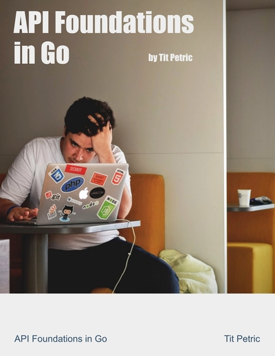</a>

With this book you'll learn to use Go, taking advantage of it's multi-threaded nature, and typed syntax. Starting your API implementation in Go is your first step towards what a rock solid API should be.

-----

### [Go for Javascript Developers](https://www.pazams.com/Go-for-Javascript-Developers/)

*Last published*: **2022**
*Authors:* **Maor Zamski** and **Daniel Singer**
*Avaible For Free* : **[Source Code](https://github.com/pazams/go-for-javascript-developers)**

This book helps Javascripters become Gophers. Outlining the differences between these languages makes it easier to switch back and forth, and can help mitigate potential issues when doing so.

-----

### [The Go Workshop](https://amzn.to/3MrFZUk)

*Last published*: **2019**
*Authors:* **Delio D'Anna**, **Andrew Hayes**, **Sam Hennessy**, **Jeremy Leasor**, **Gobin Sougrakpam**, and **Dániel Szabó**

The Go Workshop will take the pain out of learning the Go programming language (also known as Golang). It is designed to teach you to be productive in building real-world software. Presented in an engaging, hands-on way, this book focuses on the features of Go that are used by professionals in their everyday work.

-----

### [Head First Go](https://amzn.to/4r1FJdA)

*Last published*: **2019**
*Authors:* **Jay McGavren**

<a href="https://amzn.to/4r1FJdA">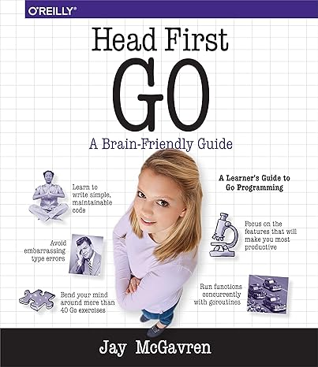</a>

Go makes it easy to build software that’s simple, reliable, and efficient. Andthis book makes it easy for programmers like you to get started. Google designed Go for high-performance networking and multiprocessing, but—like Python and JavaScript—the language is easy to read and use. With this practical hands-on guide, you’ll learn how to write Go code using clear examples that demonstrate the language in action. Best of all, you’ll understand the conventions and techniques that employers want entry-level Go developers to know.

-----

### [How to Code in Go](https://www.digitalocean.com/community/books/how-to-code-in-go-ebook)

*Last published*: **2020**
*Authors:* **Mark Bates**, **Cory LaNou** and **Tim Raymond**
*Avaible For Free* : **[epub](https://assets.digitalocean.com/books/how-to-code-in-go.epub)**, **[pdf](https://assets.digitalocean.com/books/how-to-code-in-go.pdf)**

This book is designed to introduce you to writing programs with the Go programming language. You’ll learn how to write useful tools and applications that can run on remote servers, or local Windows, macOS, and Linux systems for development. 

-----

### [Go, from the beginning](https://leanpub.com/go-from-the-beginning) *Free*

*Last published*: **2022**
*Authors:* **Chris Noring**

<a href="https://leanpub.com/go-from-the-beginning">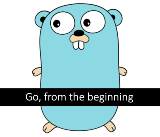</a>

In this book you will learn the following:

- Build Console apps
- Create Web APIs
- Test your code
- Create and publish reusable packages that others can consume
- Organize your files in a project
- Work with files and directories
- Parse text with the string library and regular expressions.

-----

### [Practical Go Lessons](https://www.practical-go-lessons.com/)

*Last published*: **2022**
*Authors:* **Maximilien Andile**
*Avaible For Free* : **[Read Online](https://www.practical-go-lessons.com)**

<a href="https://www.practical-go-lessons.com/">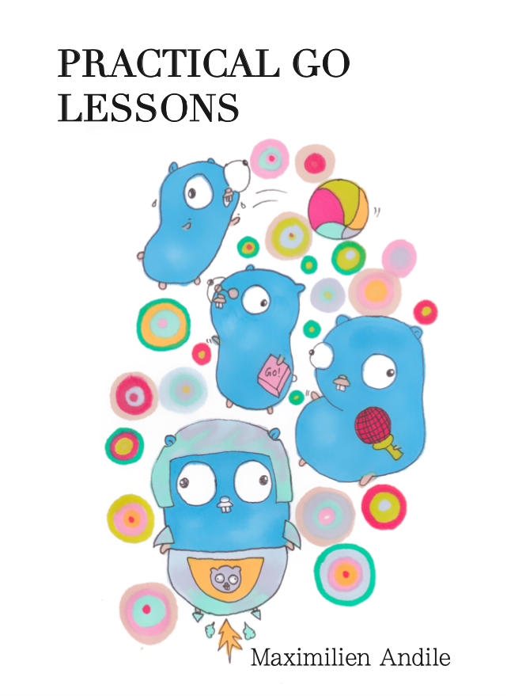</a>

Practical Go Lessons has 41 chapters and more than 700 pages with illustrations.
It is suitable for anybody how wants to start programming with the Go language.
It assumes no prior knowledge.
Each chapter contains test questions with detailed answers.
The HTML version is free. You can support the author by buying the PDF or Paper version.

-----

### [Pro Go](https://amzn.to/4rDm43L)

*Last published*: **2022**
*Authors:* **Adam Freeman**

<a href="https://amzn.to/4rDm43L">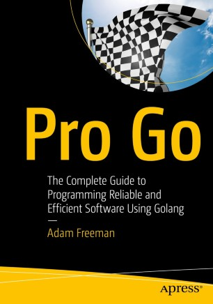</a>

Starting from the basics and building up to the most advanced and sophisticated features. You will learn how Go builds on a simple and consistent type system to create a comprehensive and productive development experience that produces fast and robust applications that run across platforms.

- Gain a solid understanding of the Go language and tools
- Gain in-depth knowledge of the Go standard library
- Use Go for concurrent/parallel tasks
- Use Go for client- and server-side development

-----

### [Go for DevOps](https://amzn.to/3LZBwrT)

*Last published*: **2022**
*Authors:* **John Doak**, **David Justice**

<a href="https://amzn.to/3LZBwrT">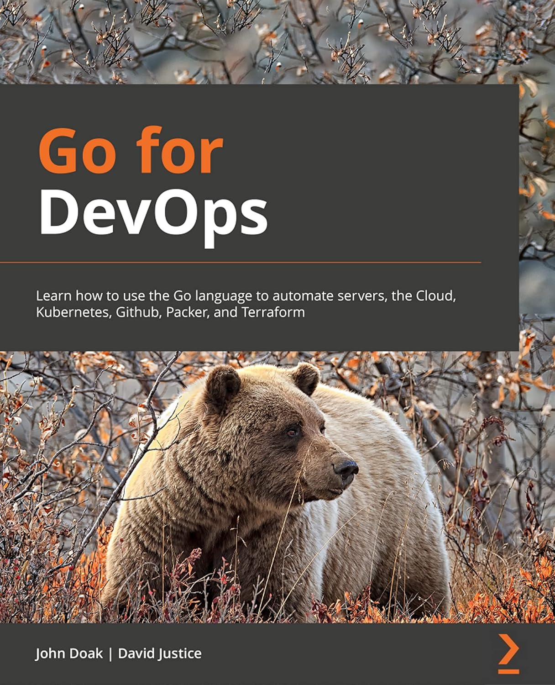</a>

Go is the go-to language for DevOps libraries and services, and without it, achieving fast and safe automation is a challenge. With the help of Go for DevOps, you'll learn how to deliver services with ease and safety, becoming a better DevOps engineer in the process.

Some of the key things this book will teach you are how to write Go software to automate configuration management, update remote machines, author custom automation in GitHub Actions, and interact with Kubernetes. As you advance through the chapters, you'll explore how to automate the cloud using software development kits (SDKs), extend HashiCorp's Terraform and Packer using Go, develop your own DevOps services with gRPC and REST, design system agents, and build robust workflow systems.

By the end of this Go for DevOps book, you'll understand how to apply development principles to automate operations and provide operational insights using Go, which will allow you to react quickly to resolve system failures before your customers realize something has gone wrong.

-----

### [Learn Go With Tests](https://quii.gitbook.io/learn-go-with-tests/)

*Last published*: **2025**
*Authors:* **Chris James**
*Avaible For Free* : **[Source Code](https://github.com/quii/learn-go-with-tests)**

Learn Go guided by tests. Write a test, learn a new Go language feature to make it pass, refactor and repeat. You'll get a grounding in test-driven development and importantly understand the principles behind it.

-----

### [Go 101](https://go101.org/article/101.html)

*Last published*: **2023**
*Authors:* **Tapir Liu**
*Avaible For Free* : **[Read Online](https://go101.org/article/101.html)**

Go 101 is a book focusing on Go syntax/semantics and all kinds of runtime related things (Go 1.17-pre ready) and tries to help gophers gain a deep and thorough understanding of Go. This book also collects many details of Go and in Go programming. It is expected that this book is helpful for both beginner and experienced Go programmers.

-----

### [Go Programming Language](https://book.gofarsi.ir/)

*Last published*: **2023**
*Authors:* **Tapir Liu**
*Avaible For Free* : **[Read Online](https://book.gofarsi.ir)**
*Language*: **Persian**

The first Persian open source book about golang deep dive.
In this book, we discuss all deep topics related to the Go language,
from the basics to the advanced, with the aim of increasing the Gopher community in Iran.

-----

### [gRPC Go for Professionals](https://amzn.to/46oiZfC)

*Last published*: **2023**
*Authors:* **Clement Jean**

<a href="https://amzn.to/46oiZfC">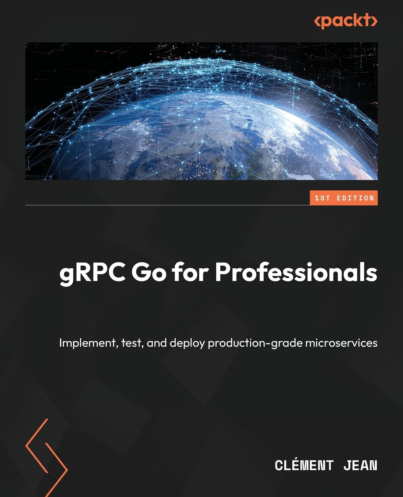</a>

In recent years, Microservice architecture has been gaining popularity. With that rise, comes a different set of requirements than we had previously. The most important one is efficient communication between the different services. That's where gRPC comes in. So naturally, this book will show you how to create gRPC servers and clients in an efficient, secure, and scalable way. But, on top of that, because Microservices are not only about communication, this book intends to show you how to deploy your application on Kubernetes and configure other tools that are needed for making your application more resilient. In that way, this book will give you all the tools that you need to start right away with gRPC in a Microservice architecture.

In gRPC Go for Professionals, you'll begin by learning the core concepts such as how the framework sends messages over the network and why it uses Protobuf for serialization and deserialization. After that, we will implement a TODO list API step by step to see the different features of gRPC. Then we are going to see how to test your services in different ways. We will see how to debug your API endpoints. And finally, we will see how to deploy the application's services by creating Docker images and using Kubernetes.

-----

### [Learn Go with Pocket-Sized Projects](https://amzn.to/4cliBlM)

*Last published*: **2025**
*Authors:* **Aliénor Latour**, **Donia Chaiehloudj**, and **Pascal Bertrand**

<a href="https://amzn.to/4cliBlM">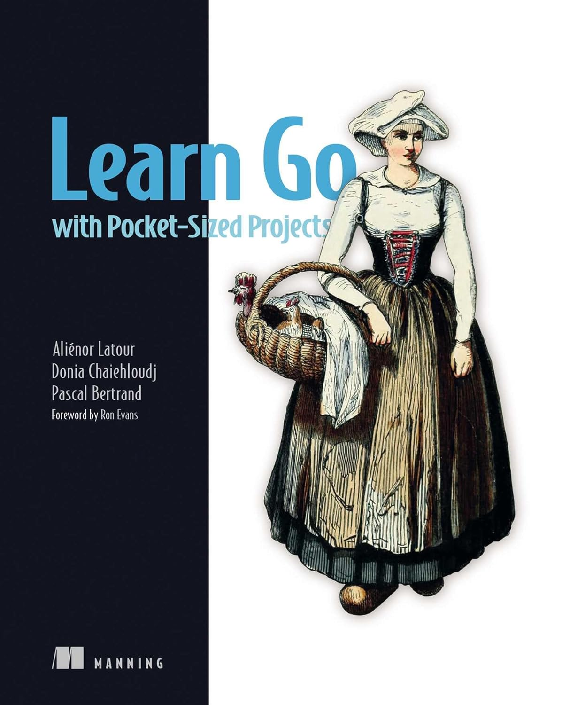</a>

Learn Go with Pocket-Sized Projects teaches you to write professional-level Go code by creating handy tools and fun apps. Each small, self-contained project introduces important practical skills, including ensuring that your code is thoroughly tested and documented! You’ll make architectural decisions for your projects and organize your code in a maintainable way. Everything you learn is easy to scale-up to full-size Go applications.

-----

### [Go Faster](https://leanpub.com/gofaster)

*Last published*: **2023**
*Authors:* **Ollie Phillips**

Some say Go is a simple language and with only 25 keywords it surely is. But, to work with Go effectively requires proficiency and understanding beyond simple syntax alone. It can take developers months or even years to acquire this experience, but this book sets out to short-circuit that process and get you there faster!

With my book, Go Faster, you can shorten your learning curve and become a proficient Go programmer, going from beginner to expert in no time. Learn Go faster and join the thriving community of skilled Go developers!

-----

### [Shipping Go](https://amzn.to/4ra6o8q)

*Last published*: **2023**
*Authors:* **Joel Holmes**

<a href="https://amzn.to/4ra6o8q">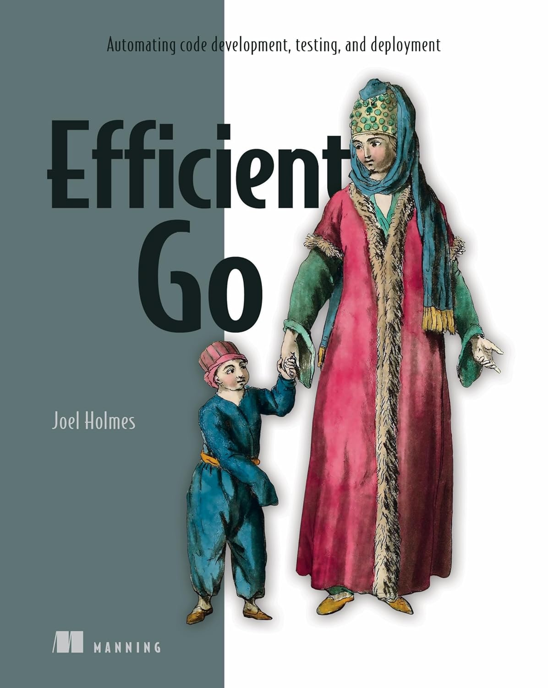</a>

You know how to build Go programs—now learn how to ship them to your customers efficiently! This practical guide to continuous delivery shows you how to rapidly establish an automated pipeline that will improve your testing, code quality, and final product.

In Shipping Go you will learn how to:
 - Develop better software based on feedback from customers
 - Create a development pipeline that turns feedback into features
 - Reduce bugs with pipeline automation that validates code before it is deployed
 - Establish continuous testing for exceptional code quality
 - Serverless, container based, and server based deployments
 - Scale your deployment in a cost-effective way
 - Deliver a culture of continuous improvement

 -----

### [gRPC Microservices in Go](https://amzn.to/4rzgHSW)

*Last published*: **2023**
*Authors:* **Hüseyin Babal**

<a href="https://amzn.to/4rzgHSW">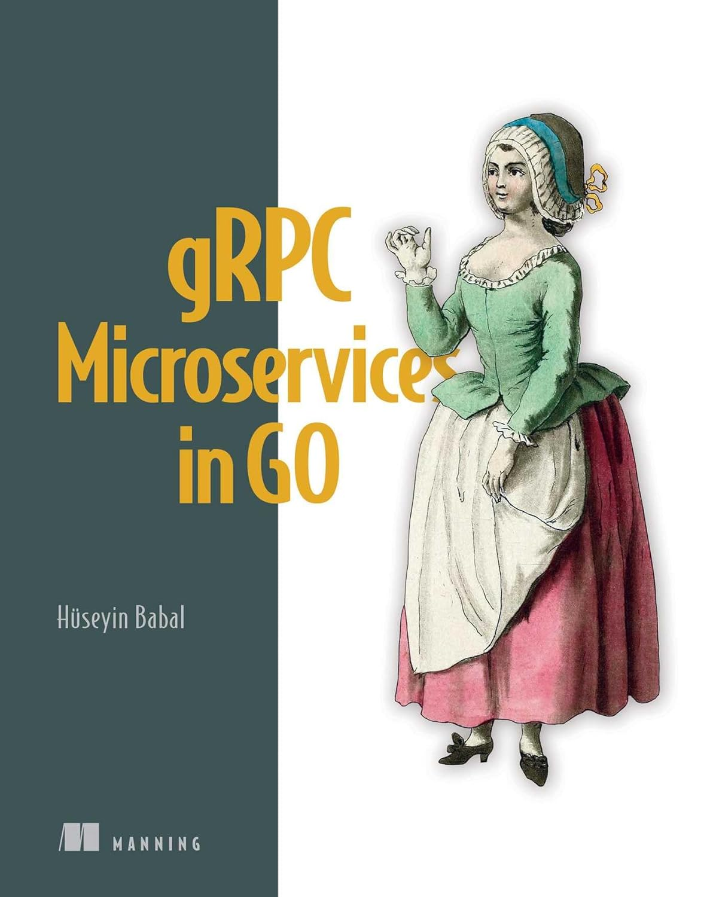</a>

For the last decade, we have heard stories about Monolith to Microservice transitions and we might think that this transition solves the majority of the problems in the organizations. However, it might end up with mess if you are not aware about best practices of this transition, since Microservice Architecture comes with its challenges. In this book, we start covering production grade best practices of Microservices Architecture and explain when to use it. Then we talk about microservice communication patterns where gRPC comes to the stage. You will see complete examples written in Go with Hexagonal Architecture applied to project structure. You will not only learn how to implement microservices, you will see how to write tests, maintain quality with proper CI, deploy to Kubernetes environment and finally set up an observable system to have better monitoring for your application.

-----

### [Learning Go: An Idiomatic Approach to Real-World Go Programming, 2nd Edition](hhttps://amzn.to/4ceJWWQ)

*Last published*: **2024**
*Authors:* **Jon Bodner**

<a href="https://amzn.to/4ceJWWQ">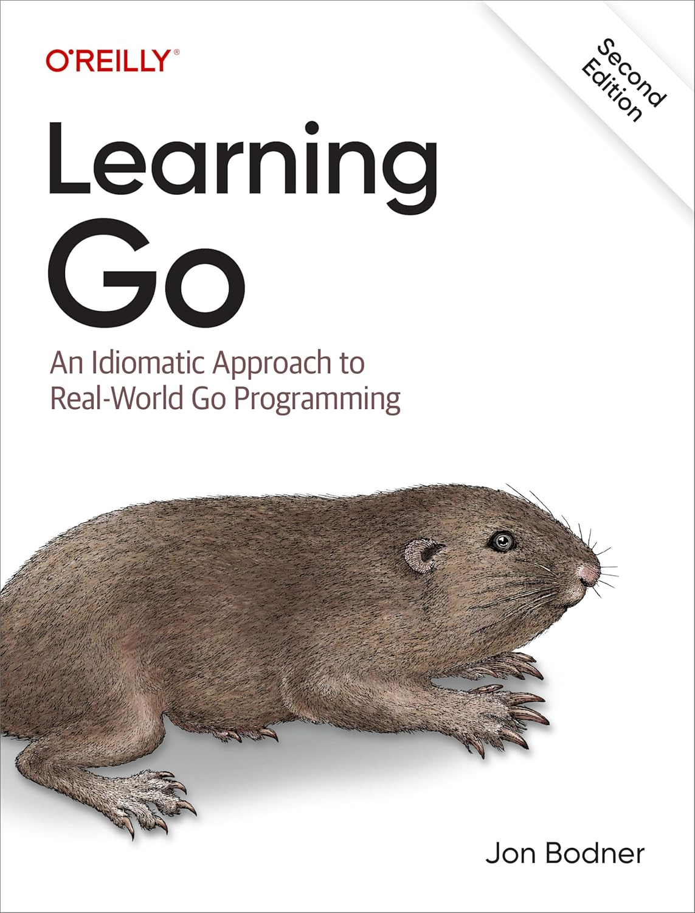</a>

Go has rapidly become the preferred language for building web services. Plenty of tutorials are available to teach Go's syntax to developers with experience in other programming languages, but tutorials aren't enough. They don't teach Go's idioms, so developers end up recreating patterns that don't make sense in a Go context. This practical guide provides the essential background you need to write clear and idiomatic Go.

No matter your level of experience, you'll learn how to think like a Go developer. Author Jon Bodner introduces the design patterns experienced Go developers have adopted and explores the rationale for using them. This updated edition also shows you how Go's generics support fits into the language.

This book helps you:

- Write idiomatic code in Go and design a Go project
- Understand the reasons behind Go's design decisions
- Set up a Go development environment for a solo developer or team
- Learn how and when to use reflection, unsafe, and cgo
- Discover how Go's features allow the language to run efficiently
- Know which Go features you should use sparingly or not at all
- Use Go's tools to improve performance, optimize memory usage, and reduce garbage collection
- Learn how to use Go's advanced development tools

-----

### [Go Programming - From Beginner to Professional, 2nd Edition](https://amzn.to/4agrPgG)

*Last published*: **2024**
*Authors:* **Samantha Coyle**

<a href="https://amzn.to/4agrPgG">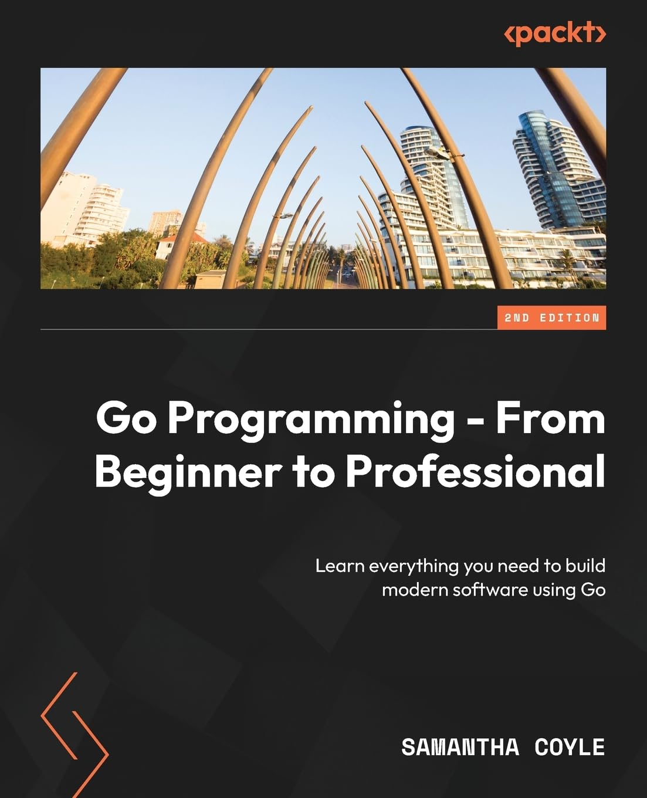</a>

Go Programming – From Beginner to Professional is a comprehensive guide that takes your proficiency in the Go programming language from novice to expert. Starting with fundamental concepts, this book covers variables, command-line tools, and working with data before delving into advanced concepts, including error handling, interfaces, and generics, harnessing Go’s latest features through hands-on exercises. Along the way, you’ll learn to structure projects using Go modules, manage packages effectively, and master debugging techniques. As you progress, you’ll get to grips with practical application-centric aspects such as command-line programming, file manipulation, and working with SQL databases. Additionally, the book explores web server development, RESTful APIs, and utilizing the Go HTTP client to interact with web applications. Further enhancing your Go skills, you’ll learn concurrent programming, testing methodologies, Go tools, and how to deploy applications in the cloud. Throughout the book, you’ll uncover Go’s hidden gems and gain insights into time manipulation, best practices, and more. By the end of this book, you’ll have worked through practical exercises and activities that’ll equip you with the knowledge and skills needed to excel as a proficient Go developer, primed for success in real-world projects.

What you will learn
- Understand the Go syntax and apply it proficiently to handle data and write functions
- Debug your Go code to troubleshoot development problems
- Safely handle errors and recover from panics
- Implement polymorphism using interfaces and gain insight into generics
- Work with files and connect to popular external databases
- Create an HTTP client and server and work with a RESTful web API
- Use concurrency to design efficient software
- Use Go tools to simplify development and improve your code

-----

### [The Deeper Love of Go](https://bitfieldconsulting.com/books/deeper)

*Last published*: **2025**
*Authors:* **John Arundel**

Introduces the Go programming language for complete beginners, as well as those with experience programming in other languages.

-----

## Advanced Books

### [Hands-On Dependency Injection in Go](https://amzn.to/4knFw1R)

<a href="https://amzn.to/4knFw1R">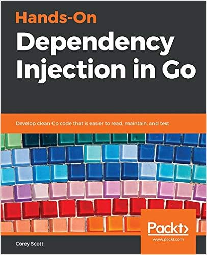</a>

*Last published*: **2018**
*Authors:* **Corey Scott**

Hands-On Dependency Injection in Go takes you on a journey, teaching you about refactoring existing code to adopt dependency injection (DI) using various methods available in Go.

Of the six methods introduced in this book, some are conventional, such as constructor or method injection, and some unconventional, such as just-in-time or config injection. Each method is explained in detail, focusing on their strengths and weaknesses, and is followed with a step-by-step example of how to apply it. With plenty of examples, you will learn how to leverage DI to transform code into something simple and flexible.

Hands-On Dependency Injection in Go takes a pragmatic approach and focuses heavily on the code, user experience, and how to achieve long-term benefits through incremental changes.

-----

### [Security with Go](https://amzn.to/3MbSHqc)

*Last published*: **2018**
*Authors:* ****

Security with Go is the first Golang security book, and it is useful for both blue team and red team applications. With this book, you will learn how to write secure software, monitor your systems, secure your data, attack systems, and extract information.

Defensive topics include cryptography, forensics, packet capturing, and building secure web applications.

Offensive topics include brute force, port scanning, packet injection, web scraping, social engineering, and post exploitation techniques.

-----

### [A Go Developer's Notebook](https://leanpub.com/GoNotebook/)

<a href="https://leanpub.com/GoNotebook/">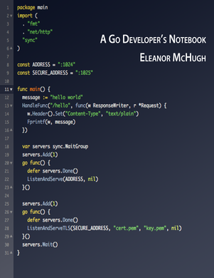</a>

*Last published*: **2019**
*Authors:* ****

A developer's experience in golang.

-----

### [Black Hat Go](https://amzn.to/4tlEqaX)

[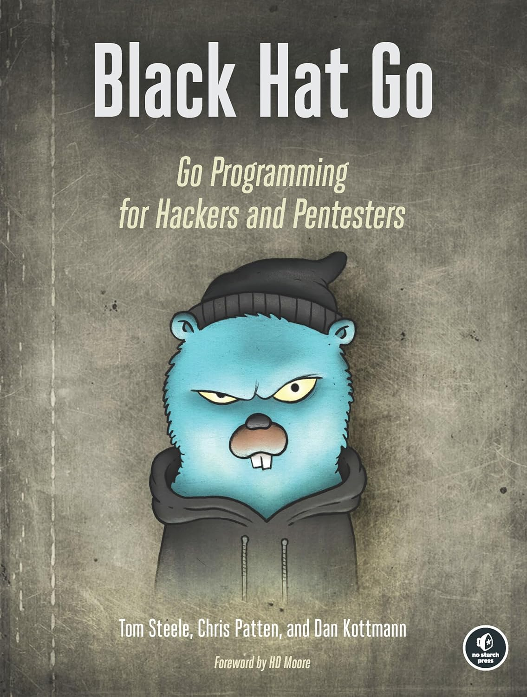](https://amzn.to/4tlEqaX)

*Last published*: **2020**
*Authors:* **Tom Steele, Chris Patten, Dan Kottmann**

In Black Hat Go, you'll learn how to write powerful and effective penetration testing tools in Go, a language revered for its speed and scalability. Start off with an introduction to Go fundamentals like data types, control structures, and error handling; then, dive into the deep end of Go’s offensive capabilities.

-----

### [Writing An Interpreter In Go](https://amzn.to/45PIyGq)

<a href="https://amzn.to/45PIyGq">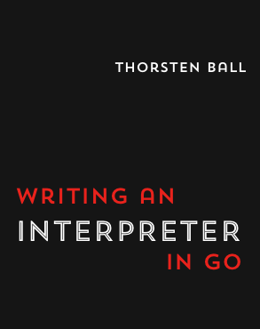</a>

*Last published*: **2020**
*Authors:* **Thorsten Ball**

In this book we will create a programming language together.

We'll start with 0 lines of code and end up with a fully working interpreter for the Monkey* programming language.

Step by step. From tokens to output. All code shown and included. Fully tested.

-----

### [Writing A Compiler In Go](https://amzn.to/4bCcFok)

<a href="https://amzn.to/4bCcFok">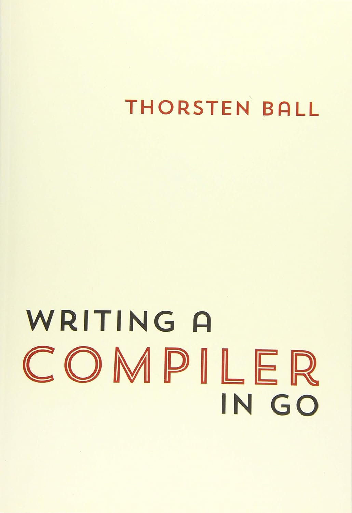</a>

*Last published*: **2020**
*Authors:* **Thorsten Ball**

This is the sequel to Writing An Interpreter In Go.

We're picking up right where we left off and write a compiler and a virtual machine for Monkey.

Runnable and tested code front and center, built from the ground up, step by step — just like before.

But this time, we're going to define bytecode, compile Monkey and execute it in our very own virtual machine.

It's the next step in Monkey's evolution.

-----

### [Hands-On Software Engineering with Golang](https://www.packtpub.com/gb/programming/hands-on-software-engineering-with-golang)

<a href="https://www.packtpub.com/gb/programming/hands-on-software-engineering-with-golang">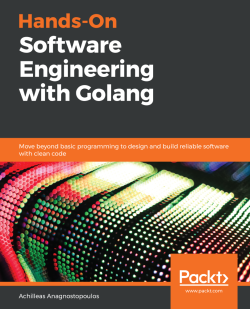</a>

*Last published*: **2020**
*Authors:* ****

This Golang book distills industry best practices for writing lean Go code that is easy to test and maintain, and helps you to explore its practical implementation by creating a multi-tier application called Links ‘R’ Us from scratch. You’ll be guided through all the steps involved in designing, implementing, testing, deploying, and scaling an application. Starting with a monolithic architecture, you’ll iteratively transform the project into a service-oriented architecture (SOA) that supports the efficient out-of-core processing of large link graphs.

You’ll learn about various cutting-edge and advanced software engineering techniques such as building extensible data processing pipelines, designing APIs using gRPC, and running distributed graph processing algorithms at scale.  Finally, you’ll learn how to compile and package your Go services using Docker and automate their deployment to a Kubernetes cluster.

-----

### [Building Distributed Applications in Gin](https://www.packtpub.com/product/building-distributed-applications-in-gin/9781801074858)

<a href="https://www.packtpub.com/product/building-distributed-applications-in-gin/9781801074858">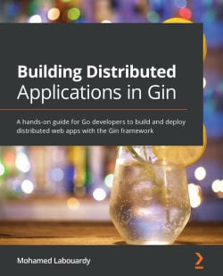</a>

*Last published*: **2021**
*Authors:* ****

Gin is a high-performance HTTP web framework used to build web applications and microservices in Go. This book is designed to teach you the ins and outs of the Gin framework with the help of practical examples.

You’ll start by exploring the basics of the Gin framework, before progressing to build a real-world RESTful API. Along the way, you’ll learn how to write custom middleware and understand the routing mechanism, as well as how to bind user data and validate incoming HTTP requests. The book also demonstrates how to store and retrieve data at scale with a NoSQL database such as MongoDB, and how to implement a caching layer with Redis. Next, you’ll understand how to secure and test your API endpoints with authentication protocols such as OAuth 2 and JWT. Later chapters will guide you through rendering HTML templates on the server-side and building a frontend application with the React web framework to consume API responses. Finally, you’ll deploy your application on Amazon Web Services (AWS) and learn how to automate the deployment process with a continuous integration and continuous delivery (CI/CD) pipeline.

By the end of this Gin book, you will be able to design, build, and deploy a production-ready distributed application from scratch using the Gin framework.

-----

### [Network Programming with Go](https://nostarch.com/networkprogrammingwithgo)

<a href="https://nostarch.com/networkprogrammingwithgo">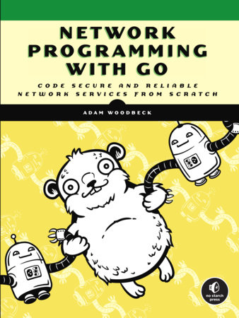</a>

*Last published*: **2021**
*Authors:* **Adam Woodbeck**

Network Programming with Go will help you leverage Go to write secure, readable, production-ready network code. Network Programming with Go is all you'll need to take advantage of Go's built-in concurrency, rapid compiling, and rich standard library.

-----

### [Powerful Command-Line Applications in Go](https://pragprog.com/titles/rggo/powerful-command-line-applications-in-go/)

<a href="https://pragprog.com/titles/rggo/powerful-command-line-applications-in-go/">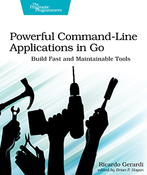</a>

*Last published*: **2021**
*Authors:* **Ricardo Gerardi**

Write your own fast, reliable, and cross-platform command-line tools with the Go programming language. Go might be the fastest—and perhaps the most fun—way to automate tasks, analyze data, parse logs, talk to network services, or address other systems requirements. Create all kinds of command-line tools that work with files, connect to services, and manage external processes, all while using tests and benchmarks to ensure your programs are fast and correct.

-----

### [Go by Example](https://www.manning.com/books/go-by-example)

<a href="https://www.manning.com/books/go-by-example">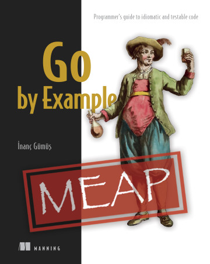</a>

*Last published*: **2021**
*Authors:* **İlker Baltacı**

Go by Example is a practical guide to writing high-quality code that’s easy to test and maintain. The book is full of best practices to adopt and anti-patterns to dodge. It explores what makes Go so dramatically different from other languages, and how you can still leverage your existing skills into writing excellent Go code. Aimed at Go beginners looking to graduate to serious Go development, you’ll write and test command line applications, web API clients and servers, concurrent programs, and more.

-----

### [Cloud Native Go - Building Reliable Services in Unreliable Environments](https://www.amazon.com/Cloud-Native-Go-Unreliable-Environments/dp/1492076333)

*Last published*: **2021**
*Authors:* **Kevin Hoffman, Dan Nemeth**

What do Docker, Kubernetes, and Prometheus have in common? All of these cloud native technologies are written in the Go programming language.
This practical book shows you how to use Go's strengths to develop cloud native services that are scalable and resilient, even in an unpredictable environment.
You'll explore the composition and construction of these applications, from lower-level features of Go to mid-level design patterns to high-level architectural considerations.

-----

### [Everyday Go](https://openfaas.gumroad.com/l/everyday-golang)

<a href="https://openfaas.gumroad.com/l/everyday-golang">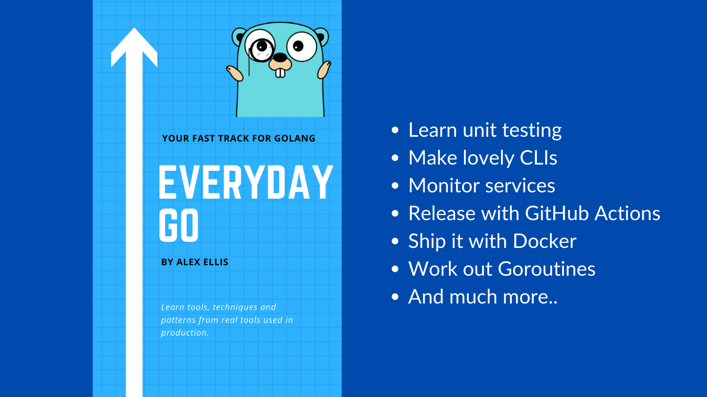</a>

*Last published*: **2021**
*Authors:* **Alex Ellis**

This book is a compilation of practical examples, lessons and techniques for Go developers. The topics cover the software lifecycle from learning the fundamentals, to software testing, to distribution and monitoring.

- Learn unit testing
- Make lovely CLIs
- Monitor services
- Release with GitHub Actions
- Ship it with Docker
- Work out Goroutines

-----

### [Practical Go: Building Scalable Network and Non-Network Applications](https://practicalgobook.net)

<a href="https://practicalgobook.net">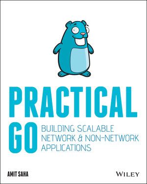</a>

*Last published*: **2021**
*Authors:* **Amit Saha**

In Practical Go - Building Scalable Network + Non-Network Applications, you will learn to use the Go programming language to build robust, production-ready software applications. You will learn just enough to building command line tools and applications communicating over HTTP and gRPC.

This practical guide will cover:

 - Writing command line applications
 - Writing a HTTP services and clients
 - Writing RPC services and clients using gRPC
 - Writing middleware for network clients and servers
 - Storing data in cloud object stores and SQL databases
 - Testing your applications using idiomatic techniques
 - Adding observability to your applications
 - Managing configuration data from your applications

You will learn to implement best practices using hands-on examples written with modern practices in mind. With its focus on using
the standard library packages as far as possible, Practical Go will give you a solid foundation for developing large applications
using Go leveraging the best of the language’s ecosystem.

-----

### [Microservices with Go](https://www.packtpub.com/product/microservices-with-go/9781804617007)
<a href="https://www.packtpub.com/product/microservices-with-go/9781804617007">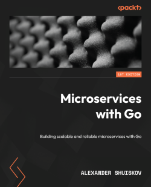</a>

*Last published*: **2022**
*Authors:* ****

This book covers the key benefits and common issues of microservices, helping you understand the problems microservice architecture helps to solve, the issues it usually introduces, and the ways to tackle them.

You’ll start by learning about the importance of using the right principles and standards in order to achieve the key benefits of microservice architecture. The following chapters will explain why the Go programming language is one of the most popular languages for microservice development and lay down the foundations for the next chapters of the book. You’ll explore the foundational aspects of Go microservice development including service scaffolding, service discovery, data serialization, synchronous and asynchronous communication, deployment, and testing. After covering the development aspects, you’ll progress to maintenance and reliability topics. The last part focuses on more advanced topics of Go microservice development including system reliability, observability, maintainability, and scalability. In this part, you’ll dive into the best practices and examples which illustrate how to apply the key ideas to existing applications, using the services scaffolded in the previous part as examples.

By the end of this book, you’ll have gained hands-on experience with everything you need to develop scalable, reliable and performant microservices using Go.

-----

### [Event-Driven Architecture in Golang](https://www.packtpub.com/product/event-driven-architecture-in-golang/9781803238012)

*Last published*: **2022**
*Authors:* ****

Event-driven architecture in Golang is an approach used to develop applications that shares state changes asynchronously, internally, and externally using messages. EDA applications are better suited at handling situations that need to scale up quickly and the chances of individual component failures are less likely to bring your system crashing down. This is why EDA is a great thing to learn and this book is designed to get you started with the help of step-by-step explanations of essential concepts, practical examples, and more.

You’ll begin building event-driven microservices, including patterns to handle data consistency and resiliency. Not only will you learn the patterns behind event-driven microservices but also how to communicate using asynchronous messaging with event streams. You’ll then build an application made of several microservices that communicates using both choreographed and orchestrated messaging.

By the end of this book, you’ll be able to build and deploy your own event-driven microservices using asynchronous communication.

-----

### [Efficient Go: Data-Driven Performance Optimization](https://www.amazon.com/Efficient-Go-Data-Driven-Performance-Optimization/dp/1098105710)

*Last published*: **2022**
*Authors:* **Bartlomiej Płotka, Frederic Branczyk**

Software engineers today typically put performance optimizations low on the list of development priorities. But despite significant technological advancements and lower-priced hardware, software efficiency still matters. With this book, Go programmers will learn how to approach performance topics for applications written in this open source language.

How and when should you apply performance efficiency optimization without wasting your time? Authors Bartlomiej Plotka and Frederic Branczyk provide the tools and knowledge you need to make your system faster using fewer resources. Once you learn how to address performance in your Go applications, you'll be able to bring small but effective habits to your programming and development cycle.

-----

### [100 Go Mistakes and How to Avoid Them](https://www.manning.com/books/100-go-mistakes-and-how-to-avoid-them)

*Last published*: **2022**
*Authors:* **Teiva Harsanyi**

100 Go Mistakes and How to Avoid Them puts a spotlight on common errors in Go code you might not even know you’re making. You’ll explore key areas of the language such as concurrency, testing, data structures, and more—and learn how to avoid and fix mistakes in your own projects.

-----

### [Know Go: Generics](https://bitfieldconsulting.com/books/generics)

*Last published*: **2022**
*Authors:* **John Arundel**

Go's 2022 introduction of generics opens up a whole new world of programming in Go. This book explains everything you need to know to start writing generic functions and types, including type parameters, constraints, and the accompanying changes to the standard library. It also offers some advice on how (and whether) you should transition your existing projects to using the new generics features.

-----

### [The Power of Go: Tests](https://bitfieldconsulting.com/books/tests)

*Last published*: **2022**
*Authors:* **John Arundel**

Go’s built-in support for testing puts tests front and centre of any software project, from command-line tools to sophisticated backend servers and APIs. This book will introduce you to all Go’s testing facilities, show you how to use them to write tests for the trickiest things, and distils the collected wisdom of the Go community on best practices for testing Go programs. Crammed with hundreds of code examples, the book uses real tests and real problems to show you exactly what to do, step by step.

-----

### [Beyond Effective Go: Part 1 - Achieving High-Performance Code](https://coreyscott.dev/book/)

*Last published*: **2022**
*Authors:* **Corey Scott**

Are you an experienced Go developer that wants to be more productive? Do you want to write cleaner, faster, and easier to maintain code?
Then the Beyond Effective Go book series is for you. This series is aimed at competent Gophers. It does not mess around with the basics but instead dives right into the daily problems that professional programmers face. Chiefly, how to write fast, robust applications and services that can be maintained and extended as requirements change.

This book, Part 1 of the series, focuses on achieving high-performance code. You will learn which aspects of your application or code to focus on and when. You will have a suite of tools, software patterns, and recipes at your disposal to make your life easier. After reading, you will:

- Understand the differences between Concurrency and Parallelism.
- Identify and avoid concurrency issues like deadlock, starvation, livelock, and data races.
- Understand the various concurrency interaction patterns and be able to apply the one that best fits the problem at hand.
- Take a deep dive into Go’s concurrency primitives and be able to apply them expertly but also avoid many of their gotchas.
- Be able to diagnose concurrency and performance issues using Go’s profiler, execution tracing, and benchmarking tools.
- Be able to identify when code needs optimizing, what needs optimizing and how.
- Have a catalog of concurrency and performance patterns that you can quickly apply to your projects.

-----

### [Domain-Driven Design with Golang](https://www.packtpub.com/product/domain-driven-design-with-golang/9781804613450)

<a href="https://www.packtpub.com/product/domain-driven-design-with-golang/9781804613450">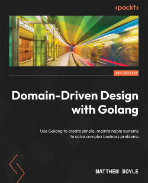</a>

*Last published*: **2022**
*Authors:* ****

Use Golang to create simple, maintainable systems to solve complex business problems.

Domain-driven design (DDD) is one of the most sought-after skills in the industry. This book provides you with step-by-step explanations of essential concepts and practical examples that will see you introducing DDD in your Go projects in no time. Domain-Driven Design with Golang starts by helping you gain a basic understanding of DDD, and then covers all the important patterns, such as bounded context, ubiquitous language, and aggregates. The latter half of the book deals with the real-world implementation of DDD patterns and teaches you how to build two systems while applying DDD principles, which will be a valuable addition to your portfolio. Finally, you’ll find out how to build a microservice, along with learning how DDD-based microservices can be part of a greater distributed system. Although the focus of this book is Golang, by the end of this book you’ll be able to confidently use DDD patterns outside of Go and apply them to other languages and even distributed systems.

-----

### [Go programming language secure coding practices guide](https://checkmarx.gitbooks.io/go-scp/) *Free*

*Last published*: **2023**
*Authors:* ****

The main goal of this book is to help developers avoid common mistakes while at the same time, learning a new programming language through a "hands-on approach". This book provides a good level of detail on "how to do it securely" showing what kind of security problems could arise during development.

-----

### [Network Automation with Go](https://www.packtpub.com/en-us/product/network-automation-with-go-9781800560925)

<a href="https://www.packtpub.com/en-us/product/network-automation-with-go-9781800560925">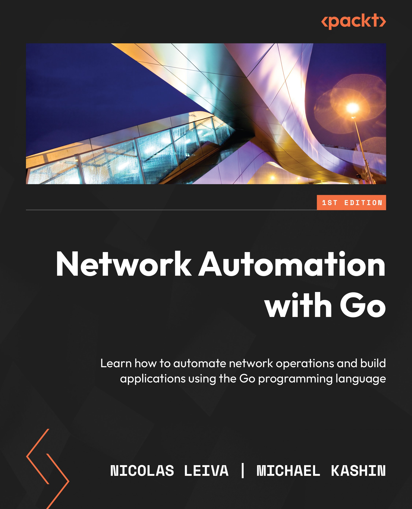</a>

*Last published*: **2023**
*Authors:* ****

Go’s built-in first-class concurrency mechanisms make it an ideal choice for long-lived low-bandwidth I/O operations, which are typical requirements of network automation and network operations applications. This book provides a quick overview of Go and hands-on examples within it to help you become proficient with Go for network automation. It’s a practical guide that will teach you how to automate common network operations and build systems using Go. The first part takes you through a general overview, use cases, strengths, and inherent weaknesses of Go to prepare you for a deeper dive into network automation. You’ll explore the common network automation areas and challenges, what language features you can use in each of those areas, and the common software tools and packages. To help deepen your understanding, you’ll also work through real-world network automation problems and apply hands-on solutions to them. By the end of this book, you’ll be well-versed with Go and have a solid grasp on network automation.

-----

### [The Power of Go: Tools](https://bitfieldconsulting.com/books/tools)

<a href="https://bitfieldconsulting.com/books/tools">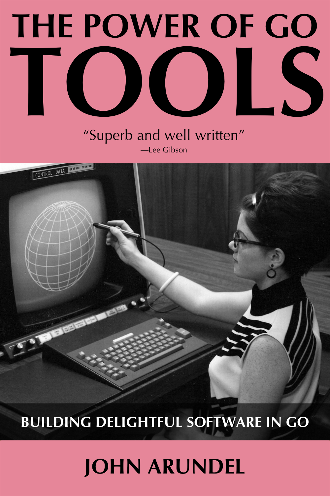</a>

*Last published*: **2024**
*Authors:* **John Arundel**

Go is a popular choice for writing DevOps and systems programs, and command-line tools in particular. How can we write simple, powerful, idiomatic, and even beautiful tools in Go? This book covers all the necessary techniques: functional options, flags and arguments, files and filesystems, executing commands, writing shells and pipelines, JSON and YAML wrangling, and even sophisticated API clients.

Even more importantly, the book teaches you how to _think_ like a master software engineer: how to break down problems into manageable chunks, how to test functions before they're written, and how to design Go CLIs that delight users.

-----

### [Build an Orchestrator in Go](https://www.manning.com/books/build-an-orchestrator-in-go)

<a href="https://www.manning.com/books/build-an-orchestrator-in-go">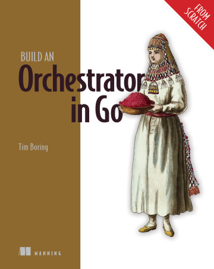</a>

*Last published*: **2024**
*Authors:* **Tim Boring**

Understand Kubernetes and other orchestration systems deeply by building your own using Go and the Docker API.

Orchestration systems like Kubernetes coordinate other software subsystems and services to create a complete organized system. Although orchestration tools have a reputation for complexity, they’re designed around few important patterns that apply across many aspects of software development. Build an Orchestrator in Go reveals the inner workings of orchestration frameworks by guiding you as you design and implement your own using the Go SDK. As you create your own orchestration framework, you’ll improve your understanding of Kubernetes and its role in distributed system design. You’ll also build the skills required to design custom orchestration solutions for those times when an out-of-the-box solution isn’t a good fit.

-----

### [Explore Go: Cryptography](https://bitfieldconsulting.com/books/crypto)

<a href="https://bitfieldconsulting.com/books/crypto">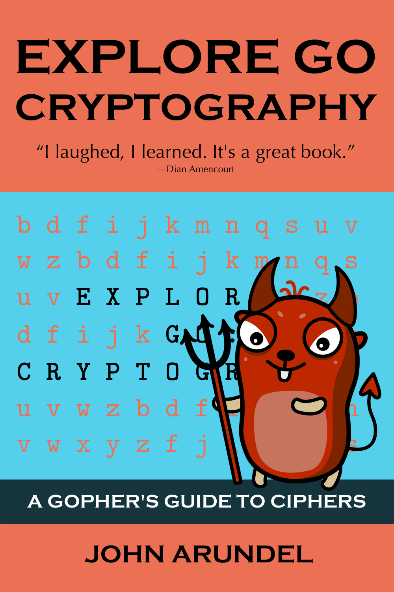</a>

*Last published*: **2024**
*Authors:* **John Arundel**

Much of the modern world is built on cryptography, and this book introduces readers to the fundamental principles of ciphers, keys, and hashing. It traces the development of increasingly sophisticated cryptographic schemes from the Caesar cipher to SHA-256 and AES-GCM, including dozens of example Go programs and coding challenges. The book concludes with a review of best practices for handling encryption and authentication in Go applications.

-----

### [Practical guide for building a blockchain from scratch in Go with gRPC](https://github.com/volodymyrprokopyuk/go-blockchain) *Free*

*Last published*: **2024**
*Authors:* ****

A foundational and practical guide for effectively learning the fundamental blockchain concepts and
progressively building a blockchain from scratch in Go with gRPC. An interesting and challenging
adventure that takes you from the foundational concepts and purpose through the technical design and
implementation to the practical testing and usage of the proposed blockchain. Simple, yet non-trivial. Concise, yet detailed. Practical, yet well-grounded.

-----

### [Go at Scale: Patterns for Professional Development](https://rezmoss.com/go-at-scale/)

*Last published*: **2025**
*Authors:* ****

Go at Scale is your comprehensive guide to writing scalable, maintainable, and efficient Go code. Moving beyond the basics, this book dives deep into advanced patterns and practices used in real-world applications.

-----

### [Go with the Domain: Building Modern Business Software in Go](https://threedots.tech/go-with-the-domain/) *Free*

<a href="https://threedots.tech/go-with-the-domain/">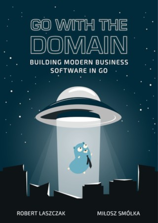</a>

*Last published*: ****
*Authors:* **Three Dots Labs**

*Go with the Domain* is a book on building Go applications that solve complex problems in an idiomatic way.
It features techniques like Domain-Driven Design, Clean Architecture, CQRS (Command Query Responsibility Segregation), and other patterns.

The book is based on a [real open source project](https://github.com/ThreeDotsLabs/wild-workouts-go-ddd-example).
Chapters go through refactoring of the project to show common anti-patterns and how to avoid them.

-----

### [Spaceship Go](https://blasrodri.github.io/spaceship-go-gh-pages/) *Free*

<a href="https://blasrodri.github.io/spaceship-go-gh-pages/">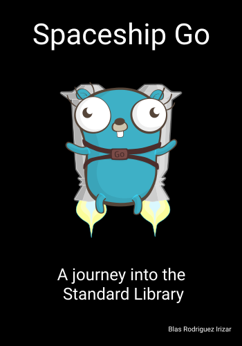</a>

*Last published*: ****
*Authors:* ****

Spaceship Go is a journey to Go's Standard Library. Several key packages are explored in order to understand
why they are useful, and also how they are implemented under the hood. It serves as a reference of some key
available tools and primitives offered by the language, which can be very helpful to write performant and idiomatic
code.

-----

### [Ultimate Go Notebook](https://courses.ardanlabs.com/courses/ultimate-go-notebook)

*Last published*: ****
*Authors:* **Ardan Labs**

The Ultimate Go Notebook is the official companion book for the Ardan Labs Ultimate Go class.

With this book, you will learn how to write more idiomatic and performant code with a focus on micro-level engineering decisions.

This notebook has been designed to provide a reference to everything mentioned in class, as if they were your own personal notes.

## Web Development

-----

### [Learn Data Structures and Algorithms with Golang](https://www.packtpub.com/product/learn-data-structures-and-algorithms-with-golang/9781789618501)

*Last published*: **2019**
*Authors:* ****

The book begins with an introduction to Go data structures and algorithms. You'll learn how to store data using linked lists, arrays, stacks, and queues. Moving ahead, you'll discover how to implement sorting and searching algorithms, followed by binary search trees. This book will also help you improve the performance of your applications by stringing data types and implementing hash structures in algorithm design. Finally, you'll be able to apply traditional data structures to solve real-world problems.
By the end of the book, you'll have become adept at implementing classic data structures and algorithms in Go, propelling you to become a confident Go programmer.

-----

### [12 Factor Applications with Docker and Go](https://leanpub.com/12fa-docker-golang)
<a href="https://leanpub.com/12fa-docker-golang">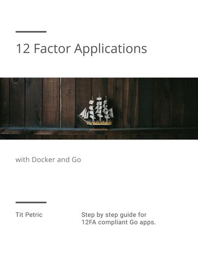</a>

*Last published*: **2020**
*Authors:* ****

A book filled with examples on how to use Docker and Go to create the ultimate 12 Factor applications. It goes over individual steps of [The Twelve-Factor App](https://12factor.net/) guidelines and how to implement them with Go and Docker.

-----

### [Webapps in Go the anti textbook](https://github.com/thewhitetulip/web-dev-golang-anti-textbook) *Free*

<a href="https://github.com/thewhitetulip/web-dev-golang-anti-textbook">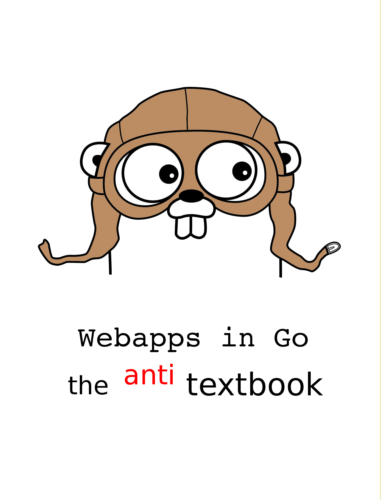</a>

*Last published*: **2021**
*Authors:* ****

This book was written to teach how to develop web applications in Go for people who know a bit of Go and have basic information about web applications in general. We (you) will build a webapp without using a third party framework and using as few external libraries as possible. The advantage is that you'll learn a lot when you code without a framework.

-----

### [Build SaaS apps in Go](https://buildsaasappingo.com)

<a href="https://buildsaasappingo.com">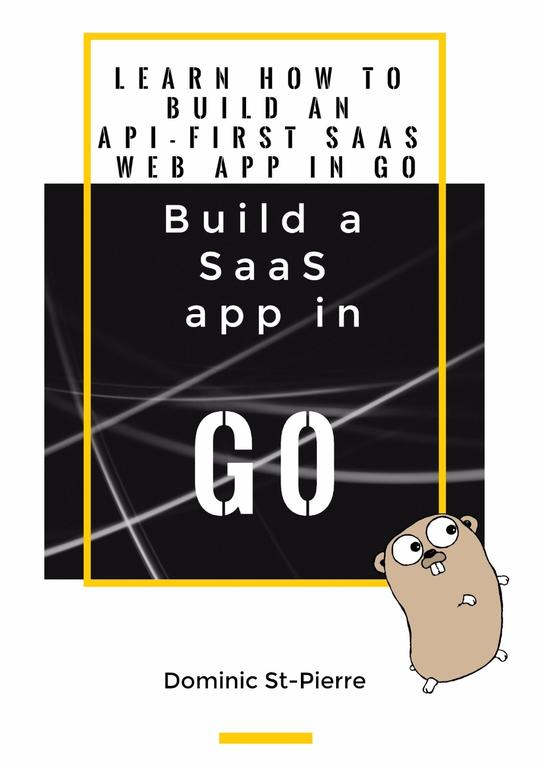</a>

*Last published*: **2021**
*Authors:* ****

Together, we'll build a strong, API-first, reusable codebase suitable for
building a SaaS or vanilla web application. By the end of the book you'll have
a solid framework to use as the starting point for future projects.

-----

### [Go Brain Teasers](https://gum.co/Qkmou)

*Last published*: **2021**
*Authors:* **Miki Tebeka**

The Go programming language is a simple one, but like all other languages it has its quirks. This book uses these quirks as a teaching opportunity. By understanding the gaps in your knowledge - you'll become better at what you do.

This book contains 25 mind bending quizzes and answers. You can view a sample chapter [here](https://www.353solutions.com/go-brain-teasers).

-----

### [Creative DIY Microcontroller Projects with TinyGo and WebAssembly](https://www.packtpub.com/product/creative-diy-microcontroller-projects-with-tinygo-and-webassembly/9781800560208)

*Last published*: **2021**
*Authors:* ****

While often considered a fast and compact programming language, Go usually creates large executables that are difficult to run on low-memory or low-powered devices such as microcontrollers or IoT. TinyGo is a new compiler that allows developers to compile their programs for such low-powered devices. As TinyGo supports all the standard features of the Go programming language, you won't have to tweak the code to fit on the microcontroller.

This book is a hands-on guide packed full of interesting DIY projects that will show you how to build embedded applications. You will learn how to program sensors and work with microcontrollers such as Arduino UNO and Arduino Nano IoT 33. The chapters that follow will show you how to develop multiple real-world embedded projects using a variety of popular devices such as LEDs, 7-segment displays, and timers. Next, you will progress to build interactive prototypes such as a traffic lights system, touchless hand wash timer, and more. As you advance, you’ll create an IoT prototype of a weather alert system and display those alerts on the TinyGo WASM dashboard. Finally, you will build a home automation project that displays stats on the TinyGo WASM dashboard.

By the end of this microcontroller book, you will be equipped with the skills you need to build real-world embedded projects using the power of TinyGo.

-----

### [Distributed Services with Go Your Guide to Reliable, Scalable, and Maintainable Systems](https://pragprog.com/titles/tjgo/distributed-services-with-go/)

<a href="https://pragprog.com/titles/tjgo/distributed-services-with-go/">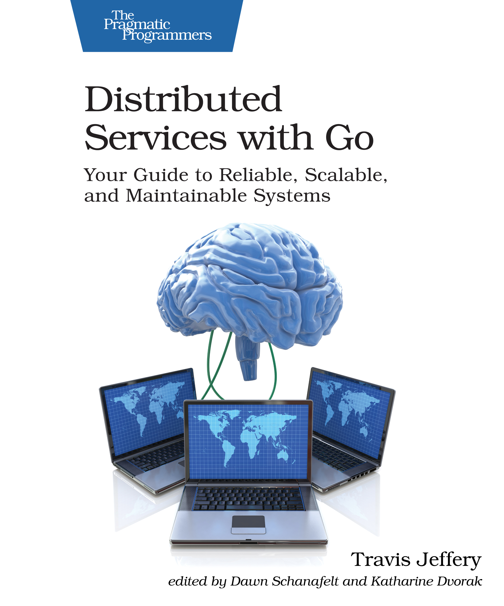</a>

*Last published*: **2021**
*Authors:* **Travis Jeffery**

Take your Go skills to the next level by learning how to design, develop, and deploy a distributed service. Start from the bare essentials of storage handling, work your way through networking a client and server, turn that single-node application into a distributed system with service discovery and consensus, and then deploy your service to the cloud. All this will make coding in your day job or side projects easier, faster, and more fun.

-----

### [Build Systems with Go: Everything a Gopher Must Know](https://www.amazon.com/dp/B091FX4CZX)

<a href="https://www.amazon.com/dp/B091FX4CZX">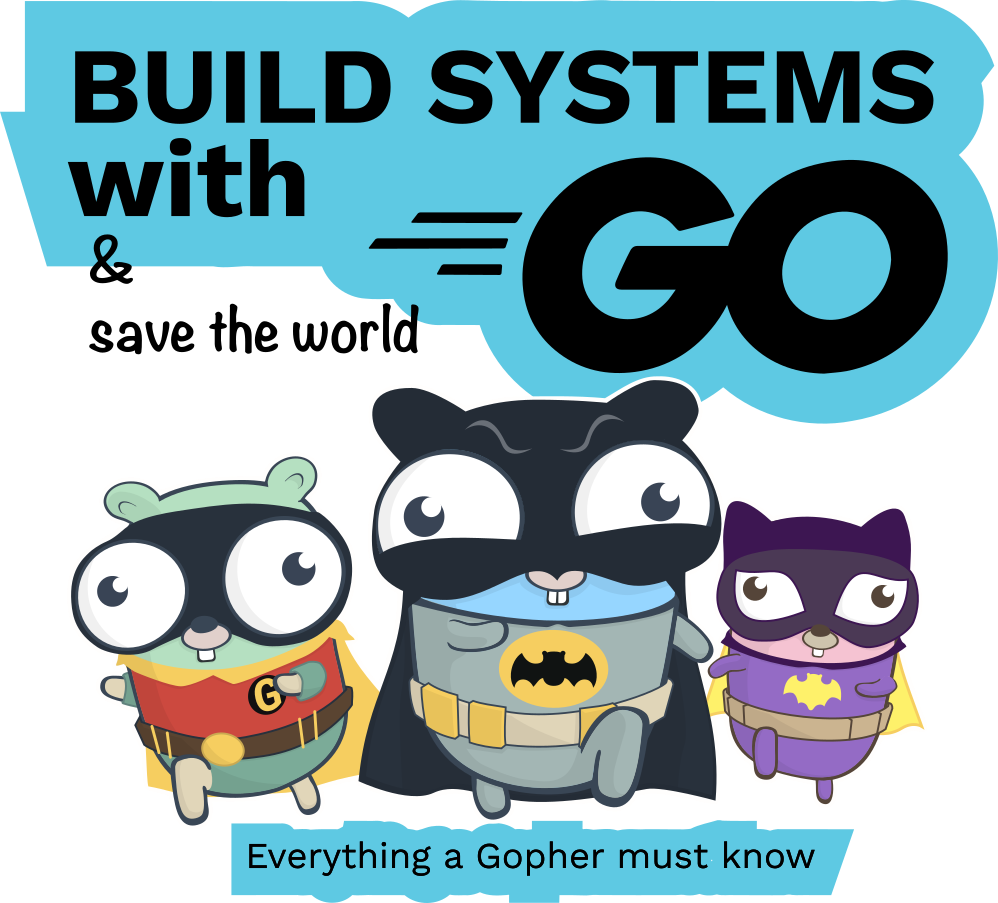</a>

*Last published*: **2021**
*Authors:* **Juan Manuel Tirado**

The Go ecosystem is helping developers to build distributed and scalable systems efficiently. If you plan to jump into this fascinating world, you must know how Go can help you to build REST APIs, use SQL/NoSQL databases, data streaming platforms, gRPC, design your own CLIs, or how to log your programs efficiently just to mention a few. *Build Systems with GO: Everything a Gopher Must Know* is split into two blocks: the first explores the Go language and its standard library, the second one provides the reader with examples and explanations of the most powerful libraries to be used in any Go development. With more than 200 detailed and straight-forward examples [available at GitHub](https://github.com/juanmanuel-tirado/savetheworldwithgo), this book helps early adopters and experienced developers to have a real view of what a system built with Go looks like.

-----

### [Let's Go!](https://lets-go.alexedwards.net/)

<a href="https://lets-go.alexedwards.net/">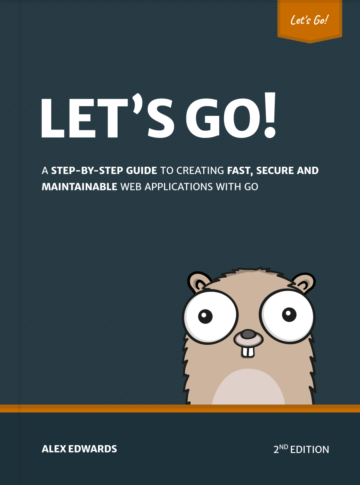</a>

*Last published*: **2023**
*Authors:* **Alex Edwards**

Let's Go teaches you step-by-step how to create fast, secure and maintainable web applications using Go. It guides you through the start-to-finish build of a real-world application — covering topics like how to structure your code, manage dependencies, authenticate and authorize users, secure your server and test your application.

-----

### [Let's Go Further](https://lets-go-further.alexedwards.net/)

<a href="https://lets-go-further.alexedwards.net/">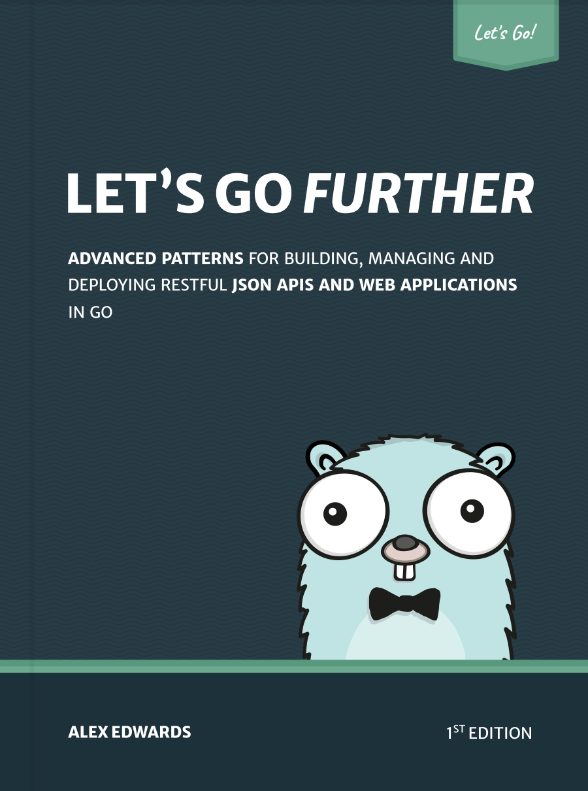</a>

*Last published*: **2023**
*Authors:* **Alex Edwards**

Let’s Go Further helps you extend and expand your knowledge of Go — taking you beyond the basics and guiding you through advanced patterns for developing, managing and deploying APIs and web applications. By the end of the book you'll have all the knowledge you need to create robust and professional APIs which act as backends for SPAs and native mobile applications, or function as stand-alone services.

-----

### [Mastering Go, 4rd edition](https://www.packtpub.com/en-us/product/mastering-go-9781805127147)

<a href="https://www.packtpub.com/en-us/product/mastering-go-9781805127147">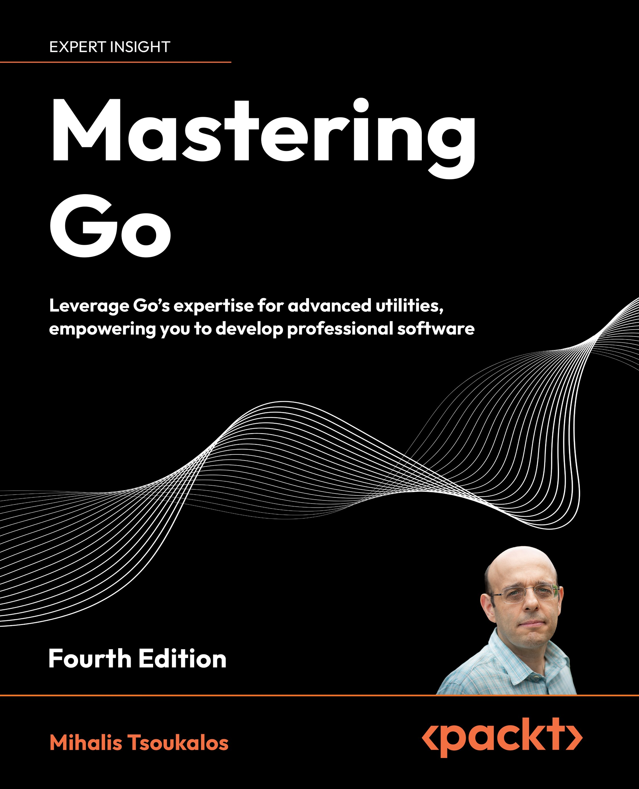</a>

*Last published*: **2024**
*Authors:* **Mihalis Tsoukalos**

This is the 4rd edition of Mastering Go. There exist many exciting new topics in this latest edition including writing RESTful services, working with the Websocket protocol, using GitHub Actions and GitLab Actions for Go projects as well as an entirely new chapter on Generics and the development of lots of practical utilities.

-----

### [Web Development with Go: Learn to Create Real World Web Applications using Go](https://www.usegolang.com/)

*Last published*: ****
*Authors:* **Jon Calhoun**

Web Development with Go was written to teach both beginners and experts how to create and deploy a real web application. You won't be building a boilerplate TODO list, but will instead be creating and deploying a production ready photo gallery application, similar to Pixieset, from scratch. The book assumes no previous web development experience and covers everything you need to know to successfully build your own web application.

-----

### [Wasm Cooking with Golang](https://k33g.gumroad.com/l/wasmcooking)

<a href="https://k33g.gumroad.com/l/wasmcooking">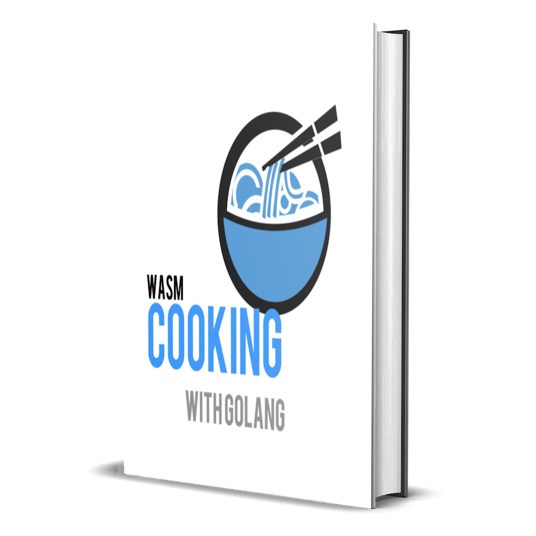</a>

*Last published*: ****
*Authors:* ****

You will learn how to generate WebAssembly applications with GoLang and run WebAssembly in your browser and out of your browser.

This e-book comprises 23 complete recipes with the code examples necessary to reproduce these recipes:
- Wasm & Go in your browser
- Wasm & Go with Node.js
- WasmEdge & Go
- Wasm in the Cloud: Do you know Atmo?

-----

### [Generative Art in Go](https://p5v.gumroad.com/l/generative-art-in-golang)

<a href="https://p5v.gumroad.com/l/generative-art-in-golang">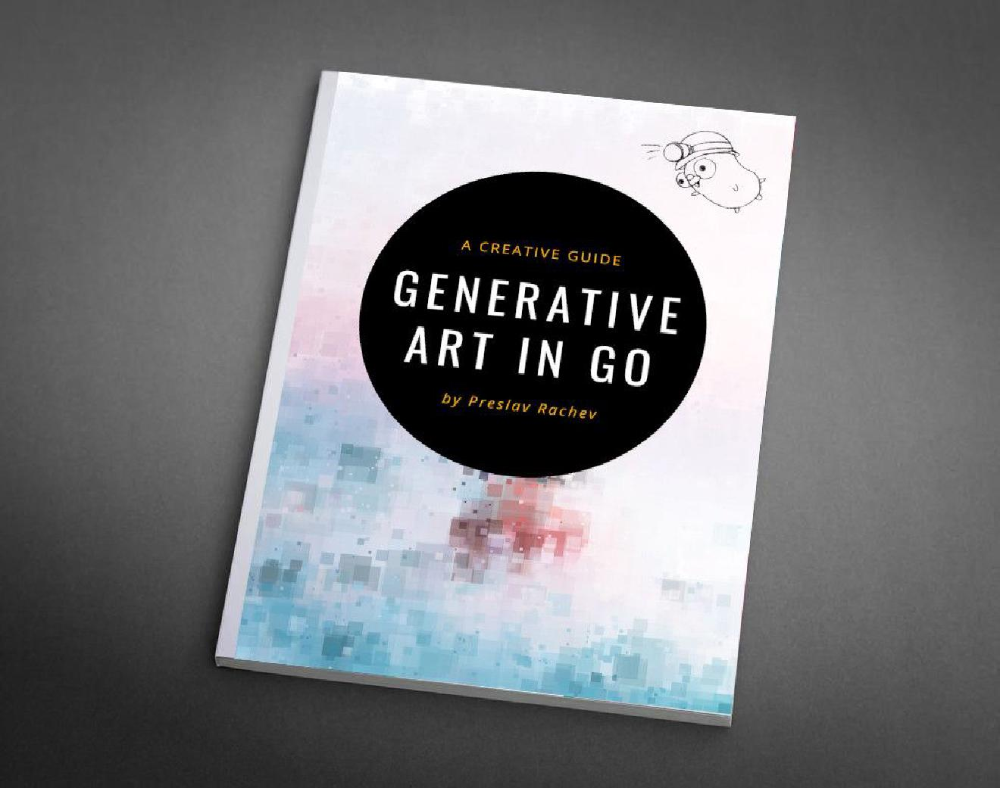</a>

*Last published*: ****
*Authors:* ****

Generative art is a unique form of artistic expression, building bridges between computer programming, randomness, and visual aesthetics.

This short book will introduce novice and experienced Go programmers to the beautiful world of algorithmic art and computer graphics. If you are looking for new areas to apply your favorite language, go check it out!

-----

### [Building Web Apps with Go](https://codegangsta.gitbooks.io/building-web-apps-with-go/content/) *Free*

*Last published*: ****
*Authors:* ****

A good resource for start Building Web Apps with Go.

-----

### [Build Web Application with Golang](https://astaxie.gitbooks.io/build-web-application-with-golang/content/en/index.html) *Free*

*Last published*: ****
*Authors:* **Astaxie**

Another awesome book for learning Web Development in Golang.

-----

## Resources

### [A tour of Go](https://tour.golang.org/)
### [Video: Learn Go Syntax in one video](https://www.youtube.com/watch?v=CF9S4QZuV30)
### [Tutorials: Go by Example](https://gobyexample.com/)
### [Go Fundamentals Video Training](https://shop.oreilly.com/category/learning-path/go-fundamentals.do)
### [More Books on the Go Wiki](https://github.com/golang/go/wiki/Books)
### [TutorialEdge.net Course](https://tutorialedge.net/course/golang/)
### [Coursera Specialization: Programming with Go](https://www.coursera.org/specializations/google-golang/)
### [Course: Understand Go's In-Depth Mechanics](https://www.udemy.com/course/learn-go-the-complete-bootcamp-course-golang/?referralCode=5CE6EB34E2B1EF4A7D37)
### [Course: Mastering Go Programming](https://www.udemy.com/course/mastering-go-programming)
### [Course: Web Development with Google’s Go Programming Language](https://www.udemy.com/course/go-programming-language)
### [Golangbot.com Articles](https://golangbot.com/)
### [Tuxerrante repo on go exercises](https://github.com/tuxerrante/go_exercises)

## Related Lists

- [Dev Books](https://github.com/devtoolsd/DevBooks) – A collection of development and programming books  
- [JavaScript Books](https://github.com/minouou/jsbooks) – A collection of books and learning resources for JavaScript  
- [PostgreSQL Books](https://github.com/sara8086/PostgresBooks) – A curated list of books and guides for PostgreSQL  
- [Python Books](https://github.com/lara-west/PythonBooks) – A comprehensive list of Python books and tutorials
- [AI Books](https://github.com/mahseema/aibooks) – A curated collection of books and resources on artificial intelligence  

Contributing
====
Your contributions are always welcome, just follow [the rules](https://github.com/dariubs/GoBooks/blob/master/CONTRIBUTING.md)!

License
====
 This work is licensed under a <a rel="license" href="https://creativecommons.org/licenses/by/4.0/">Creative Commons Attribution 4.0 International License</a>.
